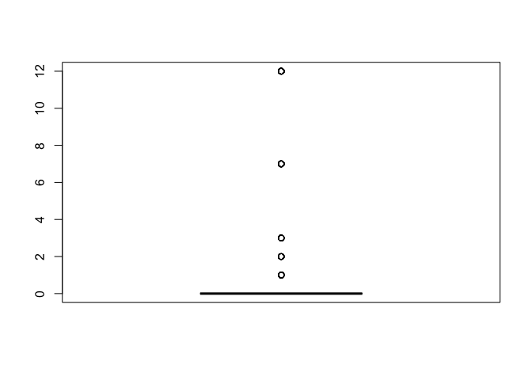
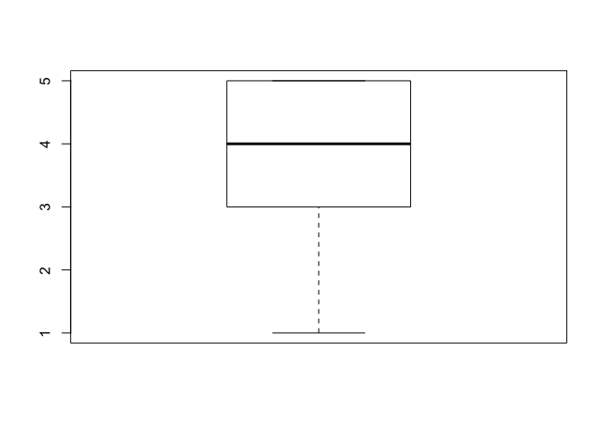
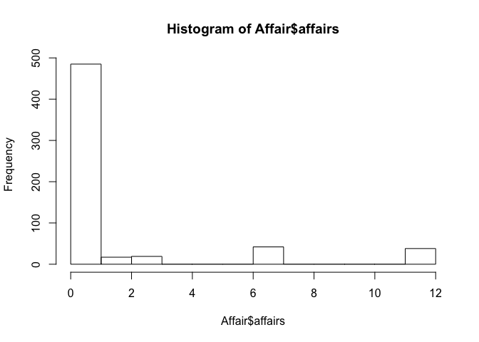
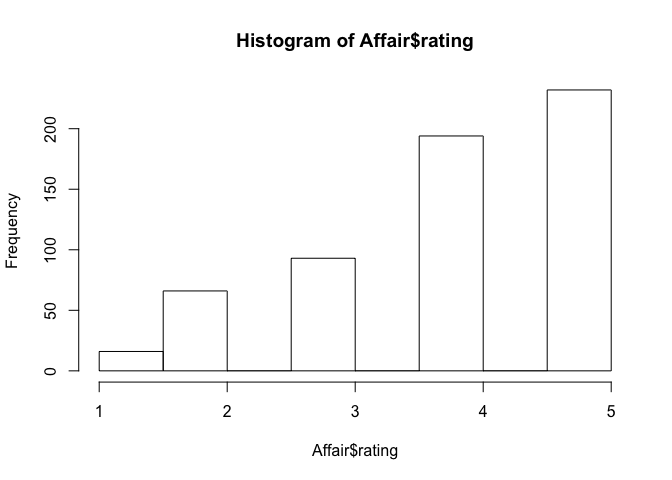
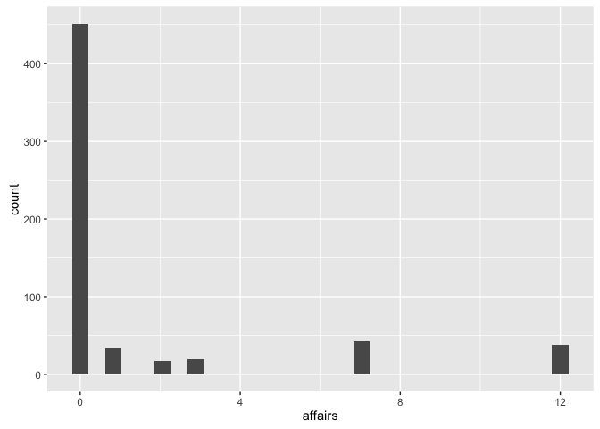
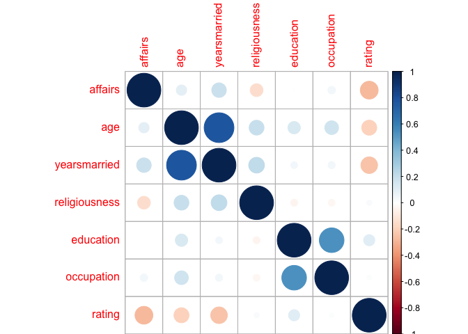

Fallstudie Affair/Seitensprünge mit R
================
Sebastian Sauer
14 April 2016

Wovon ist die Häufigkeit von Affären (Seitensprüngen) in Ehen abhängig? Diese Frage soll anhand des Datensates `Affair` untersucht werden.

Quelle: <http://statsmodels.sourceforge.net/0.5.0/datasets/generated/fair.html>

Laden wir als erstes den Datensatz in R. Wählen Sie zuerst das Verzeichsis als Arbeitsverzeichnis, in dem die Daten liegen. Dann laden Sie z.B. mit dem R-Commander (s. Skript) oder "per Hand" z.B. so:

``` r
setwd("~/Documents/OneDrive/Literatur/Methoden_Literatur/Datensaetze")
Affair <- read.csv("Affair.csv")
```

Schauen wir mal, ob es funktioniert hat ("Datenmatrix betrachten"):

``` r
head(Affair)
```

    ##   affairs gender age yearsmarried children religiousness education
    ## 1       0   male  37        10.00       no             3        18
    ## 2       0 female  27         4.00       no             4        14
    ## 3       0 female  32        15.00      yes             1        12
    ## 4       0   male  57        15.00      yes             5        18
    ## 5       0   male  22         0.75       no             2        17
    ## 6       0 female  32         1.50       no             2        17
    ##   occupation rating
    ## 1          7      4
    ## 2          6      4
    ## 3          1      4
    ## 4          6      5
    ## 5          6      3
    ## 6          5      5

Ok scheint zu passen. Was jetzt?

Geben Sie zentrale deskriptive Statistiken an für Affärenhäufigkeit und Ehezufriedenheit!
=========================================================================================

``` r
# nicht robust:
mean(Affair$affairs, na.rm = T)
```

    ## [1] 1.455907

``` r
sd(Affair$affairs, na.rm = T)
```

    ## [1] 3.298758

``` r
# robust:
median(Affair$affair, na.rm = T)
```

    ## [1] 0

``` r
IQR(Affair$affair, na.rm = T)
```

    ## [1] 0

Es scheint, die meisten Leute haben keine Affären:

``` r
table(Affair$affairs)
```

    ## 
    ##   0   1   2   3   7  12 
    ## 451  34  17  19  42  38

Man kann sich viele Statistiken mit dem Befehl `describe` aus `psych` ausgeben lassen, das ist etwas praktischer:

``` r
library(psych)
                 
describe(Affair$affairs)
```

    ##    vars   n mean  sd median trimmed mad min max range skew kurtosis   se
    ## X1    1 601 1.46 3.3      0    0.55   0   0  12    12 2.34     4.19 0.13

``` r
describe(Affair$rating)
```

    ##    vars   n mean  sd median trimmed  mad min max range  skew kurtosis   se
    ## X1    1 601 3.93 1.1      4    4.07 1.48   1   5     4 -0.83    -0.22 0.04

Dazu muss das Paket `psych` natürlich vorher installiert sein.

Visualisieren Sie zentrale Variablen!
=====================================

Sicherlich sind Diagramme auch hilfreich. Dies geht wiederum mit dem R-Commander oder z.B. mit folgenden Befehlen:

``` r
boxplot(Affair$affairs)
```



``` r
boxplot(Affair$rating)
```



``` r
hist(Affair$affairs)
```



``` r
hist(Affair$rating)
# alternativ
library(ggplot2)
```

    ## 
    ## Attaching package: 'ggplot2'

    ## The following objects are masked from 'package:psych':
    ## 
    ##     %+%, alpha



``` r
qplot(x = affairs, data = Affair)
```

    ## `stat_bin()` using `bins = 30`. Pick better value with `binwidth`.



``` r
qplot(x = rating, data = Affair)
```

    ## `stat_bin()` using `bins = 30`. Pick better value with `binwidth`.


Die meisten Menschen (dieser Stichprobe) scheinen mit Ihrer Beziehung sehr zufrieden zu sein.

Wer ist zufriedener mit der Partnerschaft: Personen mit Kindern oder ohne?
==========================================================================

Nehmen wir dazu mal ein paar dplyr-Befehle:

``` r
library(dplyr)
```

    ## 
    ## Attaching package: 'dplyr'

    ## The following objects are masked from 'package:stats':
    ## 
    ##     filter, lag

    ## The following objects are masked from 'package:base':
    ## 
    ##     intersect, setdiff, setequal, union

``` r
Affair %>% 
  group_by(children) %>% 
  summarise(rating_children = mean(rating, na.rm = T))
```

    ## # A tibble: 2 x 2
    ##   children rating_children
    ##     <fctr>           <dbl>
    ## 1       no        4.274854
    ## 2      yes        3.795349

Ah! Kinder sind also ein Risikofaktor für eine Partnerschaft! Gut, dass wir das geklärt haben.

Wie viele fehlende Werte gibt es? Was machen wir am besten damit?
=================================================================

Diesen Befehl könnten wir für jede Spalte auführen:

``` r
sum(is.na(Affair$affairs))
```

    ## [1] 0

``` r
Affair %>% 
  summarise_each(funs(sum(is.na(.))))
```

    ##   affairs gender age yearsmarried children religiousness education
    ## 1       0      0   0            0        0             0         0
    ##   occupation rating
    ## 1          0      0

Ah, gut, keine fehlenden Werte. Das macht uns das Leben leichter.

Wer ist glücklicher: Männer oder Frauen?
========================================

``` r
Affair %>% 
  group_by(gender) %>% 
  summarise(rating_gender = mean(rating))
```

    ## # A tibble: 2 x 2
    ##   gender rating_gender
    ##   <fctr>         <dbl>
    ## 1 female      3.939683
    ## 2   male      3.923077

Praktisch kein Unterschied. Heißt das auch, es gibt keinen Unterschied in der Häufigkeit der Affären?

``` r
Affair %>% 
  group_by(gender) %>% 
  summarise(affairs_gender = mean(affairs))
```

    ## # A tibble: 2 x 2
    ##   gender affairs_gender
    ##   <fctr>          <dbl>
    ## 1 female       1.419048
    ## 2   male       1.496503

Scheint auch kein Unterschied zu sein...

Und zum Abschluss noch mal etwas genauer: Teilen wir mal nach Geschlecht und nach Kinderstatus auf, also in 4 Gruppen. Theoretisch dürfte es hier auch keine Unterschiede/Zusammenhänge geben. Zumindest fällt mir kein sinnvoller Grund ein; zumal die vorherige eindimensionale Analyse keine Unterschiede zu Tage gefördert hat.

``` r
Affair %>% 
  group_by(gender, children) %>% 
  summarise(affairs_mean = mean(affairs),
            rating_mean = mean(rating))
```

    ## Source: local data frame [4 x 4]
    ## Groups: gender [?]
    ## 
    ##   gender children affairs_mean rating_mean
    ##   <fctr>   <fctr>        <dbl>       <dbl>
    ## 1 female       no    0.8383838    4.404040
    ## 2 female      yes    1.6851852    3.726852
    ## 3   male       no    1.0138889    4.097222
    ## 4   male      yes    1.6588785    3.864486

``` r
Affair %>% 
  group_by(children, gender) %>% 
  summarise(affairs_mean = mean(affairs),
            rating_mean = mean(rating))
```

    ## Source: local data frame [4 x 4]
    ## Groups: children [?]
    ## 
    ##   children gender affairs_mean rating_mean
    ##     <fctr> <fctr>        <dbl>       <dbl>
    ## 1       no female    0.8383838    4.404040
    ## 2       no   male    1.0138889    4.097222
    ## 3      yes female    1.6851852    3.726852
    ## 4      yes   male    1.6588785    3.864486

Berichten Sie eine relevante Effektstärke!
==========================================

Hm, auch keine gewaltigen Unterschiede. Höchstens für die Zufriedenheit mit der Partnerschaft bei kinderlosen Personen scheinen sich Männer und Frauen etwas zu unterscheiden. Hier stellt sich die Frage nach der Größe des Effekts, z.B. anhand Cohen's d. Dafür müssen wir noch die SD pro Gruppe wissen:

``` r
Affair %>% 
  group_by(children, gender) %>% 
  summarise(rating_mean = mean(rating),
            rating_sd = sd(rating))
```

    ## Source: local data frame [4 x 4]
    ## Groups: children [?]
    ## 
    ##   children gender rating_mean rating_sd
    ##     <fctr> <fctr>       <dbl>     <dbl>
    ## 1       no female    4.404040 0.9138302
    ## 2       no   male    4.097222 1.0636070
    ## 3      yes female    3.726852 1.1829884
    ## 4      yes   male    3.864486 1.0460525

``` r
d <- (4.4 - 4.1)/(1)
```

Die Effektstärke beträgt etwa 0.3.

Berechnen und visualisieren Sie zentrale Korrelationen!
=======================================================

``` r
Affair %>% 
  select_if(is.numeric) %>% 
  cor -> cor_tab

cor_tab
```

    ##                    affairs        age yearsmarried religiousness
    ## affairs        1.000000000  0.0952372   0.18684169   -0.14450135
    ## age            0.095237204  1.0000000   0.77754585    0.19377693
    ## yearsmarried   0.186841686  0.7775458   1.00000000    0.21826067
    ## religiousness -0.144501345  0.1937769   0.21826067    1.00000000
    ## education     -0.002437441  0.1345960   0.04000272   -0.04257108
    ## occupation     0.049611758  0.1664125   0.04459201   -0.03972232
    ## rating        -0.279512403 -0.1989999  -0.24311883    0.02429578
    ##                  education  occupation      rating
    ## affairs       -0.002437441  0.04961176 -0.27951240
    ## age            0.134596015  0.16641254 -0.19899990
    ## yearsmarried   0.040002716  0.04459201 -0.24311883
    ## religiousness -0.042571079 -0.03972232  0.02429578
    ## education      1.000000000  0.53360524  0.10930347
    ## occupation     0.533605242  1.00000000  0.01742227
    ## rating         0.109303473  0.01742227  1.00000000

``` r
library(corrplot)
corrplot(cor_tab)
```



Wie groß ist der Einfluss (das Einflussgewicht) der Ehejahre bzw. Ehezufriedenheit auf die Anzahl der Affären?
==============================================================================================================

Dazu sagen wir R: "Hey R, rechne mal ein lineares Modell", also eine normale (lineare) Regression. Dazu können wir entweder das entsprechende Menü im R-Commander auswählen, oder folgende R-Befehle ausführen:

``` r
lm1 <- lm(affairs ~ yearsmarried, data = Affair)
summary(lm1)  # Ergebnisse der Regression zeigen
```

    ## 
    ## Call:
    ## lm(formula = affairs ~ yearsmarried, data = Affair)
    ## 
    ## Residuals:
    ##     Min      1Q  Median      3Q     Max 
    ## -2.2106 -1.6575 -0.9937 -0.5974 11.3658 
    ## 
    ## Coefficients:
    ##              Estimate Std. Error t value Pr(>|t|)    
    ## (Intercept)   0.55122    0.23511   2.345   0.0194 *  
    ## yearsmarried  0.11063    0.02377   4.655    4e-06 ***
    ## ---
    ## Signif. codes:  0 '***' 0.001 '**' 0.01 '*' 0.05 '.' 0.1 ' ' 1
    ## 
    ## Residual standard error: 3.243 on 599 degrees of freedom
    ## Multiple R-squared:  0.03491,    Adjusted R-squared:  0.0333 
    ## F-statistic: 21.67 on 1 and 599 DF,  p-value: 3.996e-06

``` r
lm2 <- lm(affairs ~ rating, data = Affair)
summary(lm2)
```

    ## 
    ## Call:
    ## lm(formula = affairs ~ rating, data = Affair)
    ## 
    ## Residuals:
    ##     Min      1Q  Median      3Q     Max 
    ## -3.9063 -1.3989 -0.5631 -0.5631 11.4369 
    ## 
    ## Coefficients:
    ##             Estimate Std. Error t value Pr(>|t|)    
    ## (Intercept)   4.7421     0.4790   9.900   <2e-16 ***
    ## rating       -0.8358     0.1173  -7.125    3e-12 ***
    ## ---
    ## Signif. codes:  0 '***' 0.001 '**' 0.01 '*' 0.05 '.' 0.1 ' ' 1
    ## 
    ## Residual standard error: 3.17 on 599 degrees of freedom
    ## Multiple R-squared:  0.07813,    Adjusted R-squared:  0.07659 
    ## F-statistic: 50.76 on 1 and 599 DF,  p-value: 3.002e-12

Also: `yearsmarried` und `rating` sind beide statistisch signifikante Prädiktoren für die Häufigkeit von Affären. Das adjustierte *R*<sup>2</sup> ist allerdings in beiden Fällen nicht so groß.

Um wie viel erhöht sich die erklärte Varianz (R-Quadrat) von Affärenhäufigkeit wenn man den Prädiktor Ehezufriedenheit zum Prädiktor Ehejahre hinzufügt? (Wie) verändern sich die Einflussgewichte (b)?
=======================================================================================================================================================================================================

``` r
lm3 <- lm(affairs ~ rating + yearsmarried, data = Affair)
lm4 <- lm(affairs ~ yearsmarried + rating, data = Affair)
summary(lm3)
```

    ## 
    ## Call:
    ## lm(formula = affairs ~ rating + yearsmarried, data = Affair)
    ## 
    ## Residuals:
    ##     Min      1Q  Median      3Q     Max 
    ## -4.1474 -1.6495 -0.8365 -0.1616 11.8945 
    ## 
    ## Coefficients:
    ##              Estimate Std. Error t value Pr(>|t|)    
    ## (Intercept)   3.76913    0.56715   6.646 6.80e-11 ***
    ## rating       -0.74395    0.12005  -6.197 1.07e-09 ***
    ## yearsmarried  0.07481    0.02377   3.147  0.00173 ** 
    ## ---
    ## Signif. codes:  0 '***' 0.001 '**' 0.01 '*' 0.05 '.' 0.1 ' ' 1
    ## 
    ## Residual standard error: 3.147 on 598 degrees of freedom
    ## Multiple R-squared:  0.09315,    Adjusted R-squared:  0.09012 
    ## F-statistic: 30.71 on 2 and 598 DF,  p-value: 2.01e-13

``` r
summary(lm4)
```

    ## 
    ## Call:
    ## lm(formula = affairs ~ yearsmarried + rating, data = Affair)
    ## 
    ## Residuals:
    ##     Min      1Q  Median      3Q     Max 
    ## -4.1474 -1.6495 -0.8365 -0.1616 11.8945 
    ## 
    ## Coefficients:
    ##              Estimate Std. Error t value Pr(>|t|)    
    ## (Intercept)   3.76913    0.56715   6.646 6.80e-11 ***
    ## yearsmarried  0.07481    0.02377   3.147  0.00173 ** 
    ## rating       -0.74395    0.12005  -6.197 1.07e-09 ***
    ## ---
    ## Signif. codes:  0 '***' 0.001 '**' 0.01 '*' 0.05 '.' 0.1 ' ' 1
    ## 
    ## Residual standard error: 3.147 on 598 degrees of freedom
    ## Multiple R-squared:  0.09315,    Adjusted R-squared:  0.09012 
    ## F-statistic: 30.71 on 2 and 598 DF,  p-value: 2.01e-13

Ok. Macht eigentlich die Reihenfolge der Prädiktoren in der Regression einen Unterschied? Der Vergleich von Modell 3 vs. Modell 4 beantwortet diese Frage.

Wir sehen, dass beim 1. Regressionsmodell das R^2 0.03 war; beim 2. Modell 0.08 und beim 3. Modell liegt R^2 bei 0.09. Die Differenz zwischen Modell 1 und 3 liegt bei (gerundet) 0.06; wenig.

Welche Prädiktoren würden Sie noch in die Regressionsanalyse aufnehmen?
=======================================================================

Hm, diese Frage klingt nicht so, als ob der Dozent die Antwort selber wüsste... Naja, welche Variablen gibt es denn alles:

    ## [1] "affairs"       "gender"        "age"           "yearsmarried" 
    ## [5] "children"      "religiousness" "education"     "occupation"   
    ## [9] "rating"

Z.B. wäre doch interessant, ob Ehen mit Kinder mehr oder weniger Seitensprüngen aufweisen. Und ob die "Kinderfrage" die anderen Zusammenhänge/Einflussgewichte in der Regression verändert. Probieren wir es auch. Wir können wiederum im R-Comamnder ein Regressionsmodell anfordern oder es mit der Syntax probieren:

``` r
lm5 <- lm(affairs~ rating + yearsmarried + children, data = Affair)
summary(lm5)
```

    ## 
    ## Call:
    ## lm(formula = affairs ~ rating + yearsmarried + children, data = Affair)
    ## 
    ## Residuals:
    ##     Min      1Q  Median      3Q     Max 
    ## -4.3537 -1.7316 -0.8927 -0.1719 12.0162 
    ## 
    ## Coefficients:
    ##              Estimate Std. Error t value Pr(>|t|)    
    ## (Intercept)   3.85245    0.58808   6.551 1.24e-10 ***
    ## rating       -0.74861    0.12043  -6.216 9.57e-10 ***
    ## yearsmarried  0.08332    0.02853   2.921  0.00362 ** 
    ## childrenyes  -0.18805    0.34817  -0.540  0.58932    
    ## ---
    ## Signif. codes:  0 '***' 0.001 '**' 0.01 '*' 0.05 '.' 0.1 ' ' 1
    ## 
    ## Residual standard error: 3.148 on 597 degrees of freedom
    ## Multiple R-squared:  0.09359,    Adjusted R-squared:  0.08904 
    ## F-statistic: 20.55 on 3 and 597 DF,  p-value: 1.107e-12

``` r
r2_lm5 <- summary(lm5)$r.squared
```

Das Regressionsgewicht von `childrenyes` ist negativ. Das bedeutet, dass Ehen mit Kindern weniger Affären verbuchen (aber geringe Zufriedenheit, wie wir oben gesehen haben! Hrks!). Allerdings ist der p-Wert nich signifikant, was wir als Zeichen der Unbedeutsamkeit dieses Prädiktors verstehen können. *R*<sup>2</sup> lungert immer noch bei mickrigen 0.0935921 herum. Wir haben bisher kaum verstanden, wie es zu Affären kommt. Oder unsere Daten bergen diese Informationen einfach nicht.

Wir könnten auch einfach mal Prädiktoren, die wir haben, ins Feld schicken. Mal sehen, was dann passiert:

``` r
lm6 <- lm(affairs ~ ., data = Affair)
summary(lm6)
```

    ## 
    ## Call:
    ## lm(formula = affairs ~ ., data = Affair)
    ## 
    ## Residuals:
    ##     Min      1Q  Median      3Q     Max 
    ## -5.0503 -1.7226 -0.7947  0.2101 12.7036 
    ## 
    ## Coefficients:
    ##               Estimate Std. Error t value Pr(>|t|)    
    ## (Intercept)    5.87201    1.13750   5.162 3.34e-07 ***
    ## gendermale     0.05409    0.30049   0.180   0.8572    
    ## age           -0.05098    0.02262  -2.254   0.0246 *  
    ## yearsmarried   0.16947    0.04122   4.111 4.50e-05 ***
    ## childrenyes   -0.14262    0.35020  -0.407   0.6840    
    ## religiousness -0.47761    0.11173  -4.275 2.23e-05 ***
    ## education     -0.01375    0.06414  -0.214   0.8303    
    ## occupation     0.10492    0.08888   1.180   0.2383    
    ## rating        -0.71188    0.12001  -5.932 5.09e-09 ***
    ## ---
    ## Signif. codes:  0 '***' 0.001 '**' 0.01 '*' 0.05 '.' 0.1 ' ' 1
    ## 
    ## Residual standard error: 3.095 on 592 degrees of freedom
    ## Multiple R-squared:  0.1317, Adjusted R-squared:   0.12 
    ## F-statistic: 11.23 on 8 and 592 DF,  p-value: 7.472e-15

``` r
r2_lm6 <- round(summary(lm6)$r.squared, 2)
```

Der "." im Befehl `affairs ~ .` oben soll sagen: nimm "alle Variablen, die noch in der Datenmatrix übrig sind".

Insgesamt bleibt die erklärte Varian in sehr bescheidenem Rahmen: 0.13. Das zeigt uns, dass es immer noch nur schlecht verstanden ist -- im Rahmen dieser Analyse -- welche Faktoren die Affärenhäufigkeit erklärt.

Unterscheiden sich die Geschlechter statistisch signifikant? Wie groß ist der Unterschied? Sollte hierlieber das d-Maß oder Rohwerte als Effektmaß angegeben werden?
====================================================================================================================================================================

Hier bietet sich ein t-Test für unabhängige Gruppen an. Die Frage lässt auf eine ungerichtete Hypothese schließen (*α* sei .05). Mit dem entsprechenden Menüpunkt im R-Commander oder mit folgender Syntax lässt sich diese Analyse angehen:

``` r
t1 <- t.test(affairs ~ gender, data = Affair)
t1
```

    ## 
    ##  Welch Two Sample t-test
    ## 
    ## data:  affairs by gender
    ## t = -0.28733, df = 594.01, p-value = 0.774
    ## alternative hypothesis: true difference in means is not equal to 0
    ## 95 percent confidence interval:
    ##  -0.6068861  0.4519744
    ## sample estimates:
    ## mean in group female   mean in group male 
    ##             1.419048             1.496503

Der p-Wert ist mit 0.7739606 &gt; *α*. Daher wird die *H*<sub>0</sub> beibehalten. Auf Basis der Stichprobendaten entscheiden wir uns für die *H*<sub>0</sub>. Entsprechend umschließt das 95%-KI die Null.

Da die Differenz nicht signifikant ist, kann argumentiert werden, dass wir d auf 0 schätzen müssen. Man kann sich den d-Wert auch z.B. von {MBESS} schätzen lassen.

Dafür brauchen wir die Anzahl an Männer und Frauen: 315, 286.

``` r
library(MBESS)
ci.smd(ncp = t1$statistic,
    n.1 = 315,
    n.2 = 286)
```

    ## $Lower.Conf.Limit.smd
    ## [1] -0.1835475
    ## 
    ## $smd
    ##           t 
    ## -0.02346813 
    ## 
    ## $Upper.Conf.Limit.smd
    ## [1] 0.1366308

Das Konfidenzintervall ist zwar relativ klein (die Schätzung also aufgrund der recht großen Stichprobe relativ präzise), aber der Schätzwert für d `smd` liegt sehr nahe bei Null. Das stärkt unsere Entscheidung, von einer Gleichheit der Populationen (Männer vs. Frauen) auszugehen.

Rechnen Sie die Regressionsanalyse getrennt für kinderlose Ehe und Ehen mit Kindern!
====================================================================================

Hier geht es im ersten Schritt darum, die entsprechenden Teil-Mengen der Datenmatrix zu erstellen. Das kann man natürlich mit Excel o.ä. tun. Alternativ könnte man es in R z.B. so machen:

``` r
Affair2 <- Affair[Affair$children == "yes", ]
lm7 <- lm(affairs~ rating, data = Affair2)
summary(lm7)
```

    ## 
    ## Call:
    ## lm(formula = affairs ~ rating, data = Affair2)
    ## 
    ## Residuals:
    ##     Min      1Q  Median      3Q     Max 
    ## -4.1903 -1.4877 -0.5869 -0.4877 11.4131 
    ## 
    ## Coefficients:
    ##             Estimate Std. Error t value Pr(>|t|)    
    ## (Intercept)   5.0912     0.5701   8.930  < 2e-16 ***
    ## rating       -0.9009     0.1441  -6.252 9.84e-10 ***
    ## ---
    ## Signif. codes:  0 '***' 0.001 '**' 0.01 '*' 0.05 '.' 0.1 ' ' 1
    ## 
    ## Residual standard error: 3.336 on 428 degrees of freedom
    ## Multiple R-squared:  0.08367,    Adjusted R-squared:  0.08153 
    ## F-statistic: 39.08 on 1 and 428 DF,  p-value: 9.845e-10

``` r
Affair3 <- Affair[Affair$children == "no", ]
lm8 <- lm(affairs~ rating, data = Affair3)
summary(lm8)
```

    ## 
    ## Call:
    ## lm(formula = affairs ~ rating, data = Affair3)
    ## 
    ## Residuals:
    ##     Min      1Q  Median      3Q     Max 
    ## -2.5465 -1.0494 -0.5504 -0.5504 11.4496 
    ## 
    ## Coefficients:
    ##             Estimate Std. Error t value Pr(>|t|)   
    ## (Intercept)   3.0455     0.9140   3.332  0.00106 **
    ## rating       -0.4990     0.2083  -2.395  0.01771 * 
    ## ---
    ## Signif. codes:  0 '***' 0.001 '**' 0.01 '*' 0.05 '.' 0.1 ' ' 1
    ## 
    ## Residual standard error: 2.685 on 169 degrees of freedom
    ## Multiple R-squared:  0.03283,    Adjusted R-squared:  0.02711 
    ## F-statistic: 5.737 on 1 and 169 DF,  p-value: 0.01771

Übrigens, einfacher geht das "Subsetten" so:

``` r
library(dplyr)
Affair4 <- filter(Affair, children == "yes")
head(Affair4)
```

    ##   affairs gender age yearsmarried children religiousness education
    ## 1       0 female  32           15      yes             1        12
    ## 2       0   male  57           15      yes             5        18
    ## 3       0   male  57           15      yes             2        14
    ## 4       0 female  32           15      yes             4        16
    ## 5       0   male  37           15      yes             2        20
    ## 6       0   male  27            4      yes             4        18
    ##   occupation rating
    ## 1          1      4
    ## 2          6      5
    ## 3          4      4
    ## 4          1      2
    ## 5          7      2
    ## 6          6      4

Rechnen Sie die Regression nur für "Halodries"; d.h. für Menschen mit Seitensprüngen. Dafür müssen Sie alle Menschen ohne Affären aus den Datensatz entfernen.
==============================================================================================================================================================

Also, rechnen wir nochmal die Standardregression (`lm1`). Probieren wir den Befehl `filter` dazu nochmal aus:

``` r
Affair5 <- filter(Affair, affairs != 0)
lm9 <- lm(affairs ~ rating, data = Affair5)
summary(lm9)
```

    ## 
    ## Call:
    ## lm(formula = affairs ~ rating, data = Affair5)
    ## 
    ## Residuals:
    ##     Min      1Q  Median      3Q     Max 
    ## -6.0605 -3.5157 -0.0605  3.6895  7.4843 
    ## 
    ## Coefficients:
    ##             Estimate Std. Error t value Pr(>|t|)    
    ## (Intercept)   8.7570     1.0225   8.564  1.3e-14 ***
    ## rating       -0.8483     0.2800  -3.030  0.00289 ** 
    ## ---
    ## Signif. codes:  0 '***' 0.001 '**' 0.01 '*' 0.05 '.' 0.1 ' ' 1
    ## 
    ## Residual standard error: 4.144 on 148 degrees of freedom
    ## Multiple R-squared:  0.05841,    Adjusted R-squared:  0.05205 
    ## F-statistic: 9.181 on 1 and 148 DF,  p-value: 0.002887

Berechnen Sie für eine logistische Regression mit "Affäre ja vs. nein" als Kriterium, wie stark der Einfluss von Geschlecht, Kinderstatus, Ehezufriedenheit und Ehedauer ist!
=============================================================================================================================================================================

``` r
Affair %>% 
  mutate(affairs_dichotom = if_else(affairs == 0, 0, 1)) %>% 
  glm(affairs_dichotom ~gender + children + rating + yearsmarried, data = .) -> lm10

summary(lm10)
```

    ## 
    ## Call:
    ## glm(formula = affairs_dichotom ~ gender + children + rating + 
    ##     yearsmarried, data = .)
    ## 
    ## Deviance Residuals: 
    ##      Min        1Q    Median        3Q       Max  
    ## -0.57662  -0.26766  -0.17186  -0.06459   0.93295  
    ## 
    ## Coefficients:
    ##               Estimate Std. Error t value Pr(>|t|)    
    ## (Intercept)   0.515778   0.079344   6.501 1.69e-10 ***
    ## gendermale    0.037945   0.034218   1.109    0.268    
    ## childrenyes   0.054032   0.046307   1.167    0.244    
    ## rating       -0.090337   0.015985  -5.651 2.47e-08 ***
    ## yearsmarried  0.003947   0.003787   1.042    0.298    
    ## ---
    ## Signif. codes:  0 '***' 0.001 '**' 0.01 '*' 0.05 '.' 0.1 ' ' 1
    ## 
    ## (Dispersion parameter for gaussian family taken to be 0.1746456)
    ## 
    ##     Null deviance: 112.56  on 600  degrees of freedom
    ## Residual deviance: 104.09  on 596  degrees of freedom
    ## AIC: 663.8
    ## 
    ## Number of Fisher Scoring iterations: 2

Wenn `if_else` unbekannt ist, lohnt sich ein Blick in die Hilfe mit `?if_else` (`dplyr` muss vorher geladen sein).

Aha, signifikant ist die Ehezufriedenheit: Je größer `rating` desto geringer die Wahrscheinlickeit für `affairs_dichotom`. Macht Sinn!

Übrigens, die Funktion `lm` und `glm` spucken leider keine brave Tabelle in Normalform aus. Aber man leicht eine schöne Tabelle (data.frame) bekommen mit dem Befehl `tidy` aus `broom`:

``` r
library(broom)
tidy(lm10) 
```

    ##           term     estimate   std.error statistic      p.value
    ## 1  (Intercept)  0.515777667 0.079343849  6.500537 1.693109e-10
    ## 2   gendermale  0.037944509 0.034217912  1.108908 2.679172e-01
    ## 3  childrenyes  0.054032156 0.046307172  1.166820 2.437495e-01
    ## 4       rating -0.090336904 0.015984908 -5.651387 2.468646e-08
    ## 5 yearsmarried  0.003946811 0.003786673  1.042290 2.976998e-01

Und Tabellen (d.h. brave Dataframes) kann man sich schön ausgeben lassen z.B. mit dem Befehl `knitr::kable`:

``` r
library(knitr)
tidy(lm10) %>% kable
```

| term         |    estimate|  std.error|  statistic|    p.value|
|:-------------|-----------:|----------:|----------:|----------:|
| (Intercept)  |   0.5157777|  0.0793438|   6.500538|  0.0000000|
| gendermale   |   0.0379445|  0.0342179|   1.108908|  0.2679172|
| childrenyes  |   0.0540322|  0.0463072|   1.166821|  0.2437495|
| rating       |  -0.0903369|  0.0159849|  -5.651387|  0.0000000|
| yearsmarried |   0.0039468|  0.0037867|   1.042290|  0.2976998|

Puh. Geschafft!
